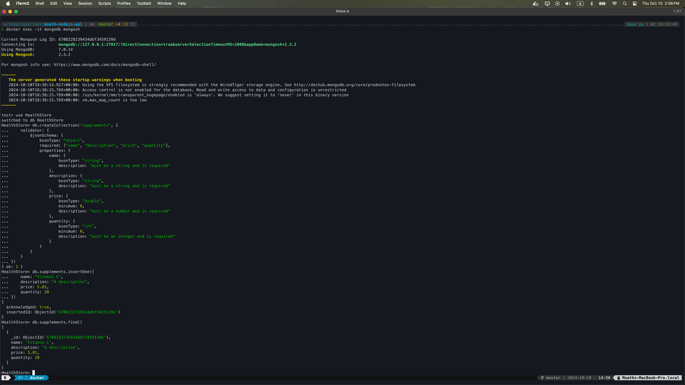
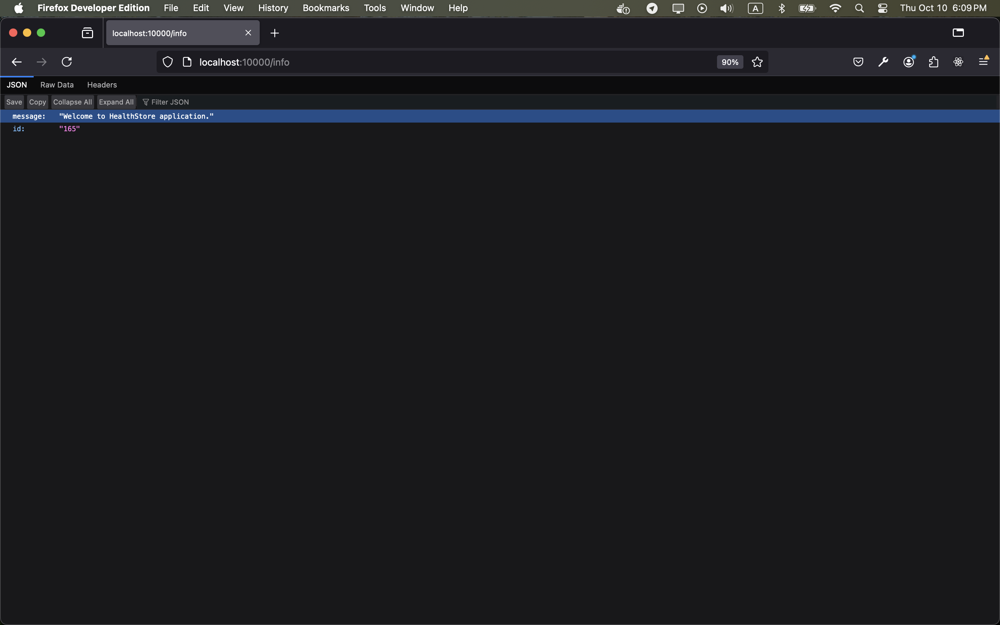
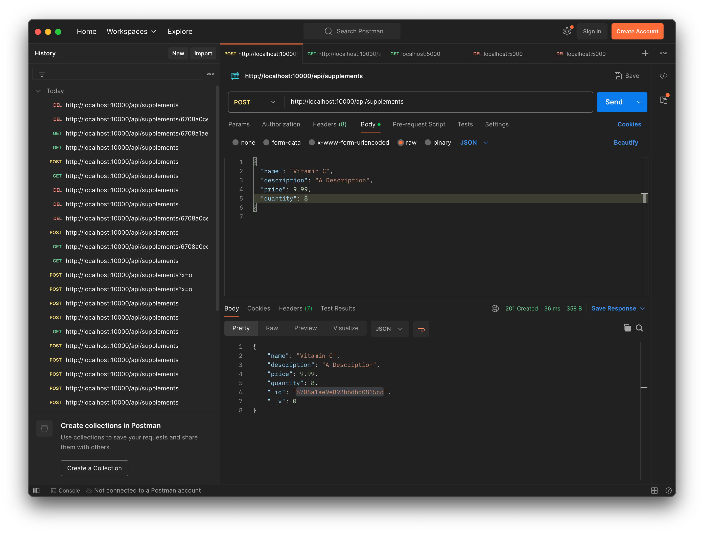
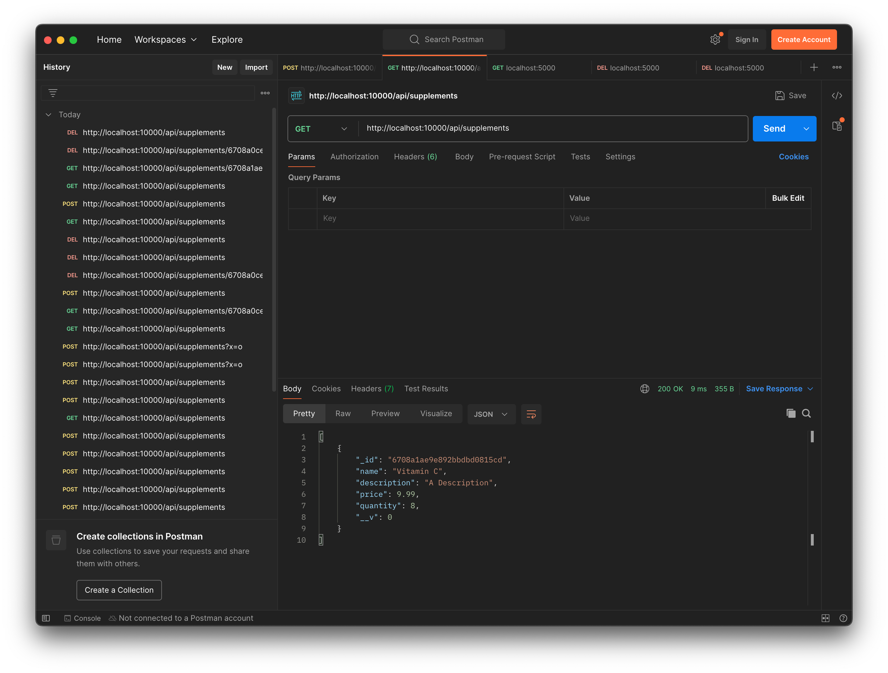
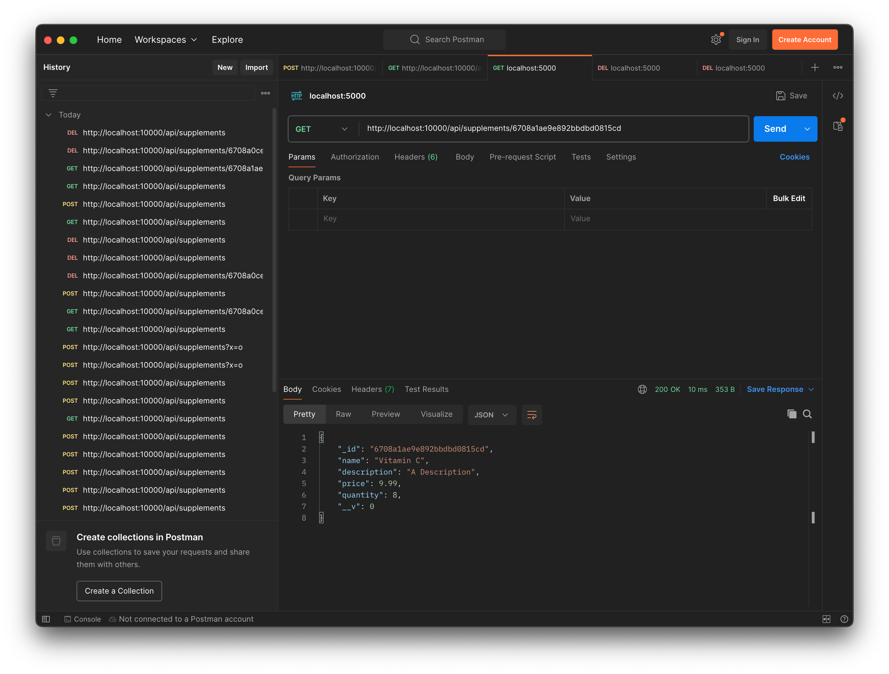
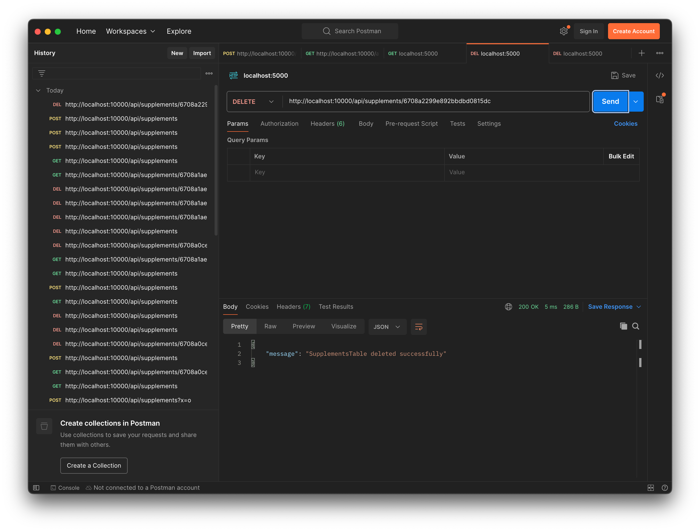
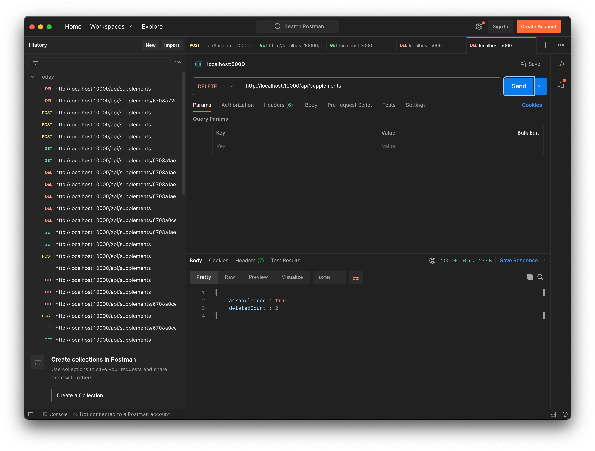

# Node.js API


## Run the project
if you do not have mongodb running, you can run a container
```bash
docker pull mongodb/mongodb-community-server:latest
docker run --name mongodb -p 27017:27017 mongodb/mongodb-community-server:latest
docker exec -it mongodb mongosh

```

```bash
> docker exec -it mongodb mongosh

Current Mongosh Log ID: 6708228239434dbf3459139d
Connecting to:          mongodb://127.0.0.1:27017/?directConnection=true&serverSelectionTimeoutMS=2000&appName=mongosh+2.3.2
Using MongoDB:          7.0.14
Using Mongosh:          2.3.2

For mongosh info see: https://www.mongodb.com/docs/mongodb-shell/

------
   The server generated these startup warnings when booting
   2024-10-10T18:38:14.927+00:00: Using the XFS filesystem is strongly recommended with the WiredTiger storage engine. See http://dochub.mongodb.org/core/prodnotes-filesystem
   2024-10-10T18:38:15.769+00:00: Access control is not enabled for the database. Read and write access to data and configuration is unrestricted
   2024-10-10T18:38:15.769+00:00: /sys/kernel/mm/transparent_hugepage/enabled is 'always'. We suggest setting it to 'never' in this binary version
   2024-10-10T18:38:15.769+00:00: vm.max_map_count is too low
------

test> use HealthStore
switched to db HealthStore
HealthStore> db.createCollection("supplements", {
...     validator: {
...         $jsonSchema: {
...             bsonType: "object",
...             required: ["name", "description", "price", "quantity"],
...             properties: {
...                 name: {
...                     bsonType: "string",
...                     description: "must be a string and is required"
...                 },
...                 description: {
...                     bsonType: "string",
...                     description: "must be a string and is required"
...                 },
...                 price: {
...                     bsonType: "double",
...                     minimum: 0,
...                     description: "must be a number and is required"
...                 },
...                 quantity: {
...                     bsonType: "int",
...                     minimum: 0,
...                     description: "must be an integer and is required"
...                 }
...             }
...         }
...     }
... })
{ ok: 1 }
HealthStore> db.supplements.insertOne({
...     name: "Vitamin C",
...     description: "A description",
...     price: 5.01,
...     quantity: 20
... })
{
  acknowledged: true,
  insertedId: ObjectId('6708233739434dbf3459139e')
}
HealthStore> db.supplements.find()
[
  {
    _id: ObjectId('6708233739434dbf3459139e'),
    name: 'Vitamin C',
    description: 'A description',
    price: 5.01,
    quantity: 20
  }
]
```
## Screenshots







